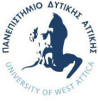
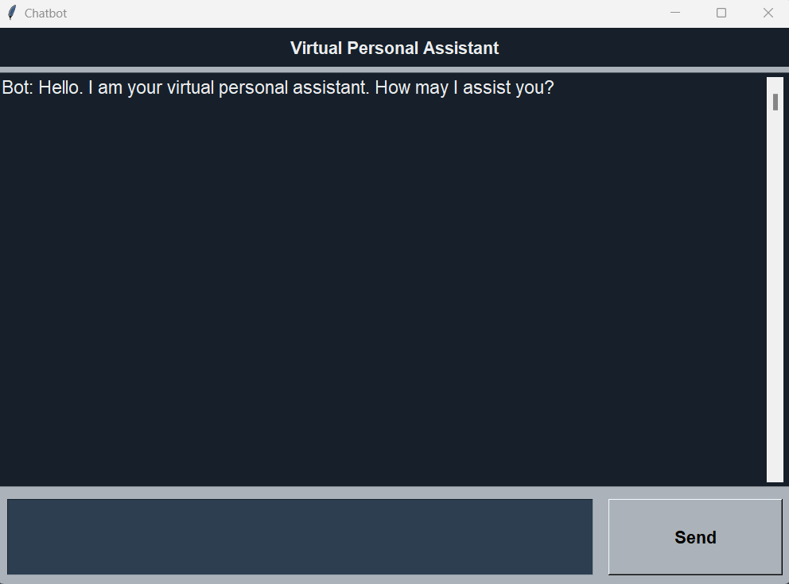
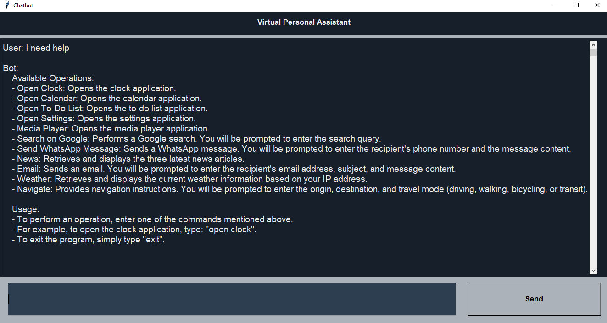
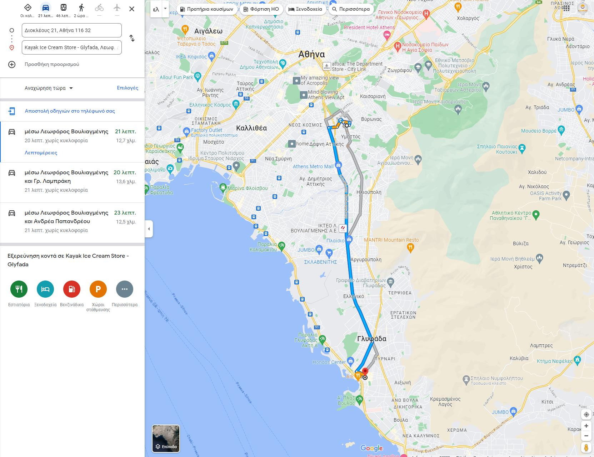
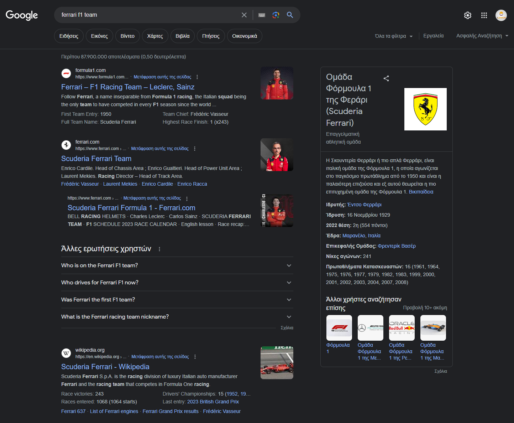
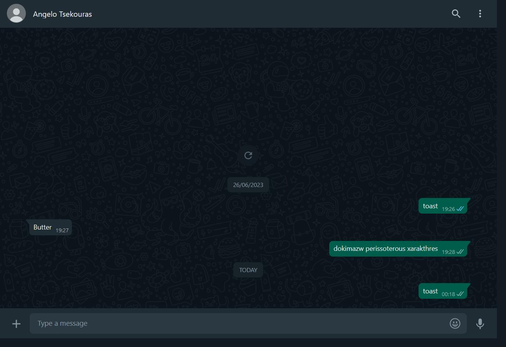
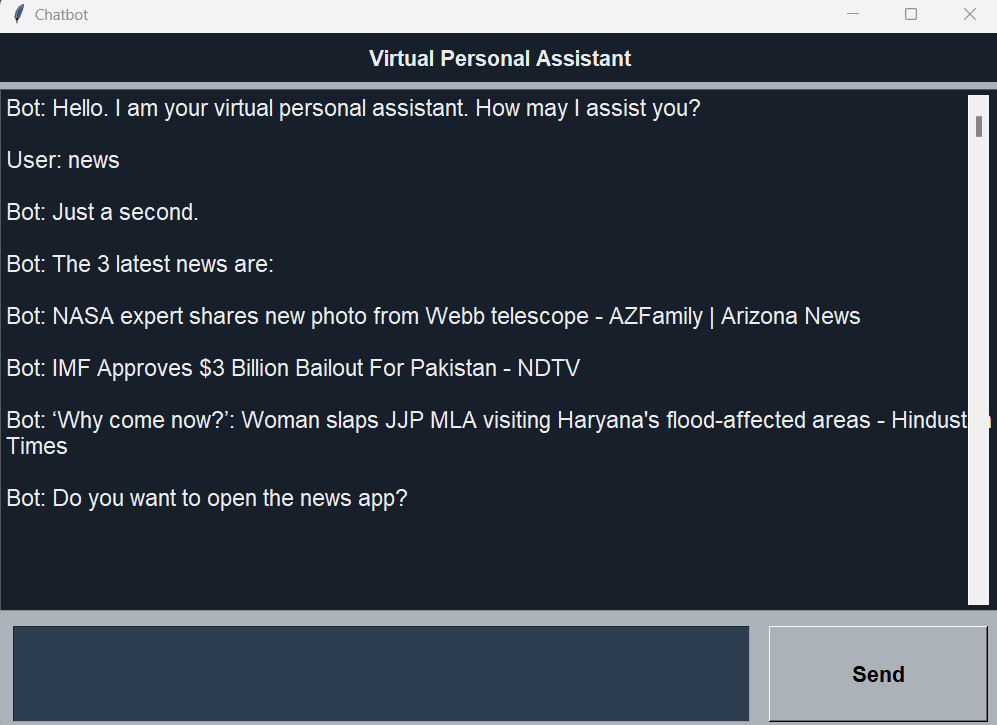
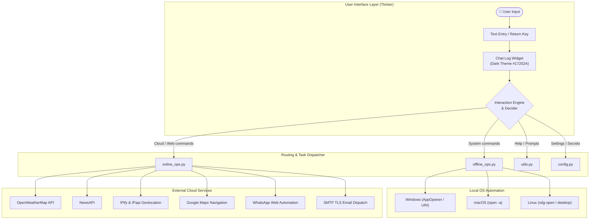
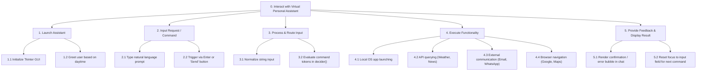

# Virtual Personal Assistant 🤖

<div align="center">



### Human-Computer Interaction (HCI) University Course Project
**University of West Attica (UNIWA) • Department of Informatics and Computer Engineering**  
*Academic Year: 2022–2023 • Instructor: Asst. Prof. Christos Troussas*

[](https://www.python.org/)
[](https://docs.python.org/3/library/tkinter.html)
[](https://github.com/)
[](LICENSE)

</div>

---

## 📖 Overview

The **Virtual Personal Assistant** is an interactive desktop conversational agent developed as the capstone project for the **Human-Computer Interaction (HCI)** course at the **University of West Attica**.

The project focuses on applying core principles of user-centered design, usability engineering, dialogue management, and Hierarchical Task Analysis (HTA) to create an intuitive desktop companion capable of orchestrating local OS tasks, cloud information services, and real-time communication.

### 🌟 Key Highlights
- **Conversational Desktop GUI**: Sleek dark-mode interface built with Tkinter featuring responsive chat bubbles, auto-scrolling, and natural time-based greetings.
- **Cross-Platform OS Automation**: Launches native desktop utilities (Clock, Calendar, Settings, Media Player) across Windows, macOS, and Linux.
- **Smart Cloud & Web Integrations**: Real-time weather reporting via IP geolocation, top news headlines from NewsAPI, Google search queries, and route navigation with Google Maps.
- **Automated Communication**: Instant WhatsApp message dispatch via browser automation and direct email composition via secure SMTP TLS.
- **Rigorous HCI Documentation**: Accompanied by a full **User Manual** and **Technical Analysis Manual** with Hierarchical Task Analysis (HTA) models.

---

## 🖼️ Visual Showcase

<div align="center">

### Main Interface & Conversational Flow
| Welcome & Interaction | Built-in Help & Commands |
| :---: | :---: |
|  |  |

### Cloud Services & Navigation
| Google Maps Route Calculation | Google Search in Browser |
| :---: | :---: |
|  |  |

### Automation & Communication
| WhatsApp Web Automation | News Headlines Feed |
| :---: | :---: |
|  |  |

</div>

---

## 🏗️ Architecture & Interaction Flow

The assistant is architected around a modular decoupled design separating presentation, decision logic, local system hooks, and external REST/Web services.



---

## 🧠 Hierarchical Task Analysis (HTA)

In accordance with HCI evaluation requirements, user interaction workflows were formally modeled via **Hierarchical Task Analysis (HTA)**:



---

## 🎯 Human-Computer Interaction (HCI) Principles

The application was designed adhering to fundamental usability guidelines and Nielsen's Heuristics:

1. **Visibility of System Status**:
   - The assistant immediately acknowledges commands using natural conversational affirmations (*"Cool, I'm on it"*, *"Just a second"*).
   - Real-time error messages explain why an operation failed instead of silently failing.
2. **Match Between System and Real World**:
   - Uses conversational English dialogue with context-aware greetings based on system clock (Morning, Afternoon, Evening).
   - Recognizes casual phrasing (e.g. *"Can you open calendar?"*, *"Help me navigate"*).
3. **User Control & Freedom**:
   - Users can abort interactive multi-step prompts or type `exit` at any time.
   - Comprehensive `help` command lists all system capabilities on demand.
4. **Consistency & Standards**:
   - Standard keyboard shortcuts (`<Return>` key to submit commands).
   - High-contrast color palette (`#17202A` background with `#EAECEE` text) providing comfortable readability and reduced eye strain.
5. **Graceful Error Management & Accessibility**:
   - Cross-platform fallbacks prevent crashes if a platform-specific application is missing.
   - Input entry retains auto-focus for seamless hands-on-keyboard workflows.

---

## ⚡ Command Reference

| Command Pattern | Category | Action Performed | Example Natural Phrasing |
| :--- | :---: | :--- | :--- |
| `open clock` | System | Launches system Clock application | *"Please open clock"* |
| `open calendar` | System | Launches system Calendar application | *"Can you open calendar?"* |
| `open settings` | System | Opens System Settings / Preferences | *"Open settings"* |
| `media player` | System | Launches default media/music player | *"Open media player"* |
| `open to do list` | Cloud | Launches Microsoft To-Do task manager | *"Please open to do list"* |
| `search on google` | Web | Prompts for search query and opens Google | *"Search on Google"* |
| `send whatsapp` | Comms | Prompts for recipient phone & message | *"Please send whatsapp message"* |
| `email` | Comms | Prompts for recipient, subject & body | *"Send an email"* |
| `weather` | Cloud | Resolves IP city & fetches real-time weather | *"What's the weather?"* |
| `news` | Cloud | Fetches the 3 latest top headlines | *"Show me the news"* |
| `navigate` | Web | Prompts for origin, destination & travel mode | *"Help me navigate"* |
| `help` | General | Displays comprehensive commands manual | *"Help"* |
| `exit` / `quit` | General | Safely closes the assistant | *"Exit"* |

---

## 🚀 Getting Started

### Prerequisites
- **Python 3.9+** (Compatible with Python 3.9, 3.10, 3.11, 3.12)
- Operating System: **Windows 10/11**, **macOS**, or **Linux**

### 1. Clone the Repository
```bash
git clone https://github.com/MG04/Virtual-Assistant-Chat-Bot.git
cd Virtual-Assistant-Chat-Bot
```

### 2. Set Up a Virtual Environment
```bash
# Create virtual environment
python3 -m venv .venv

# Activate on macOS/Linux:
source .venv/bin/activate

# Activate on Windows:
.venv\Scripts\activate
```

### 3. Install Dependencies
```bash
pip install -r requirements.txt
```

### 4. Configure Environment Variables
Copy the example environment configuration:
```bash
cp .env.example .env
```
Open `.env` in any text editor to configure optional API keys:
- **`NEWS_API_KEY`**: Free key from [NewsAPI](https://newsapi.org/) (for news headlines).
- **`OPENWEATHER_APP_ID`**: Free key from [OpenWeatherMap](https://openweathermap.org/api) (for live weather).
- **`GMAIL_ADDRESS` & `GMAIL_APP_PASSWORD`**: (Optional) For sending automated emails via SMTP TLS.

*(Note: Desktop automation, Google search, navigation, and Microsoft To-Do work immediately without any API keys!)*

### 5. Run the Application
```bash
python main.py
```
*(or run `python src/main.py`)*

---

## 📂 Project Structure

```text
├── assets/
│   ├── uniwa_logo.png               # University of West Attica crest
│   └── screenshots/                 # High-resolution screenshots showcase
│       ├── 01_welcome_screen.png
│       ├── 02_command_clock.png
│       ├── 03_command_media_player.png
│       ├── 04_command_calendar.png
│       ├── 05_command_settings.png
│       ├── 06_command_todo_list.png
│       ├── 07_command_news.png
│       ├── 08_command_whatsapp.png
│       ├── 09_whatsapp_web_automated.png
│       ├── 10_command_google_search.png
│       ├── 11_google_search_results.png
│       ├── 12_command_navigation.png
│       ├── 13_google_maps_directions.png
│       └── 14_command_help.png
├── docs/
│   ├── User_Manual.pdf              # Comprehensive User Guide (Greek, with screenshots)
│   ├── Technical_Manual.pdf         # System Architecture & HTA Design Guide (Greek)
│   └── Assignment_Specification_2022-2023.pdf # Course assignment brief
├── src/
│   ├── __init__.py                  # Package declaration
│   ├── config.py                    # Secure settings & .env variable manager
│   ├── main.py                      # Tkinter GUI, event bindings & decider engine
│   ├── offline_ops.py               # Cross-platform desktop app launchers
│   ├── online_ops.py                # External API queries, SMTP email & WhatsApp hooks
│   └── utils.py                     # Dialogue variations & help documentation
├── .env.example                     # Environment template for API keys
├── .gitignore                       # Git ignore rules for Python, OS & binaries
├── LICENSE                          # MIT License
├── main.py                          # Top-level executable launcher
├── README.md                        # Project documentation & showcase
└── requirements.txt                 # Documented project dependencies
```

---

## 📚 Deliverables & Documentation

Original university project reports are preserved in the [`docs/`](docs/) directory:
- [📖 User Manual (`docs/User_Manual.pdf`)](docs/User_Manual.pdf): User instructions with step-by-step walkthroughs and visual screenshots.
- [📐 Technical Manual (`docs/Technical_Manual.pdf`)](docs/Technical_Manual.pdf): System architecture specifications and complete Hierarchical Task Analysis (HTA).
- [📋 Course Assignment Brief (`docs/Assignment_Specification_2022-2023.pdf`)](docs/Assignment_Specification_2022-2023.pdf): University assignment rubric and functional criteria.

---

## 👥 Development Team & Academic Credits

**University of West Attica (ΠΑΔΑ)**  
**School of Engineering**  
**Department of Informatics and Computer Engineering**  
**Course**: Human-Computer Interaction (*Αλληλεπίδραση Ανθρώπου - Υπολογιστή*)  
**Academic Year**: 2022–2023  
**Course Instructor**: Asst. Prof. Christos Troussas  

### Team Members
- **Marios Gkoura** (ΓΚΟΥΡΑ ΜΑΡΙΟΣ) — ID: `20390041`
- **Ioannis Drakos** (ΔΡΑΚΟΣ ΙΩΑΝΝΗΣ) — ID: `20390060`
- **Angelos Tsekouras** (ΤΣΕΚΟΥΡΑΣ ΑΓΓΕΛΟΣ) — ID: `20390240`
- **Stylianos Papakostopoulos** (ΠΑΠΑΚΩΣΤΟΠΟΥΛΟΣ ΣΤΥΛΙΑΝΟΣ) — ID: `20390276`

---

## 📄 License

This project is licensed under the **MIT License** — see the [LICENSE](LICENSE) file for details.
